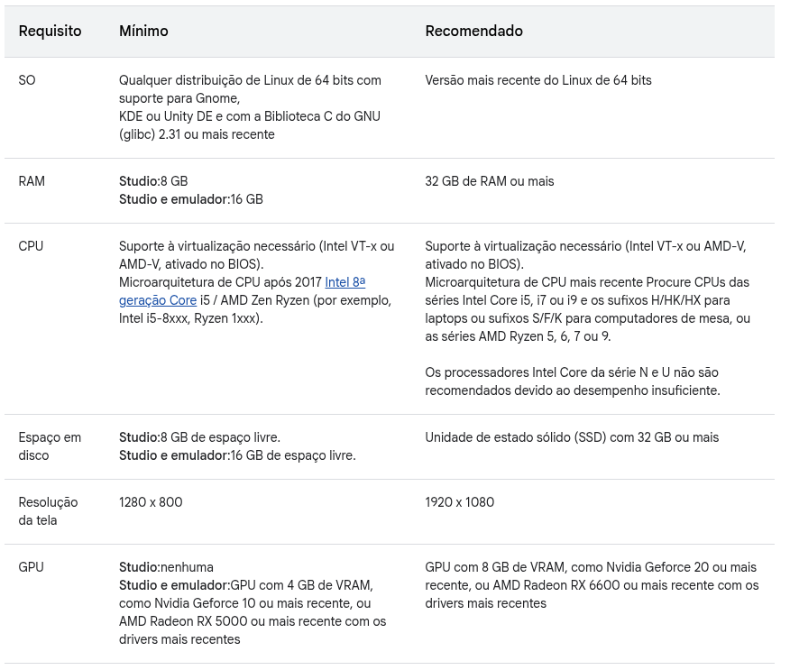
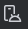
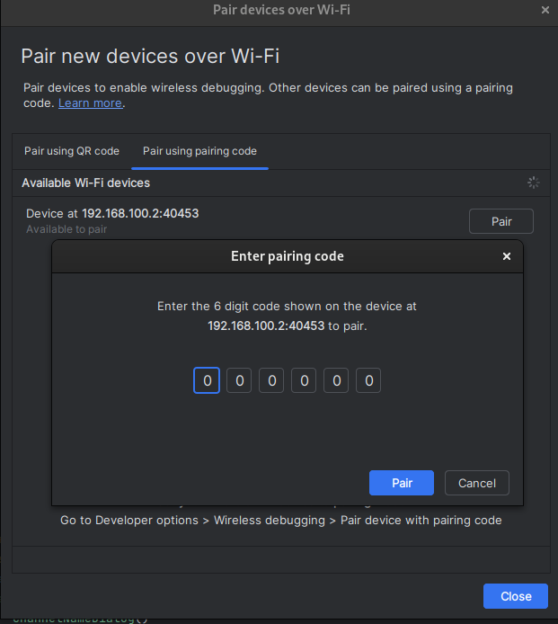
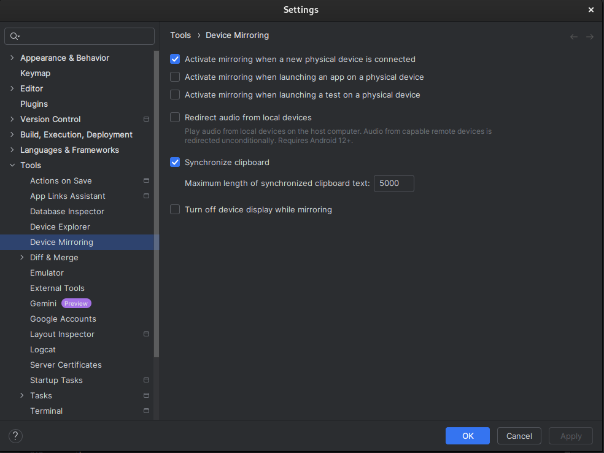
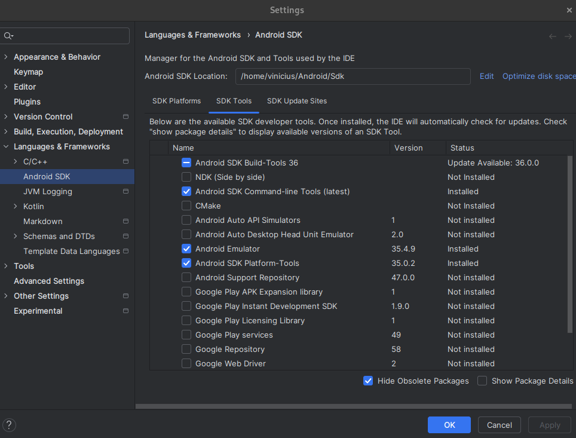

# Usando o seu dispositivo físico 📱
> ⚠️ Documento ainda não finalizado

(Por: [Vinícius F. Maciel](https://github.com/ViniciusFM))

Depurar um aplicativo diretamente em um dispositivo físico usando o Android Studio é uma técnica extremamente útil, especialmente para quem utiliza computadores com hardware mais modesto. Ao invés de depender do emulador, que costuma consumir grandes quantidades de memória RAM e poder de processamento, o uso de um smartphone ou tablet real permite uma execução mais leve e fluida durante o desenvolvimento. Essa abordagem não só melhora o desempenho geral do Android Studio em máquinas com recursos limitados, como também oferece uma experiência de testes mais próxima do uso real do aplicativo, facilitando a identificação de problemas de desempenho e usabilidade.

Atualmente, para garantir uma execução fluida do Android Studio em conjunto com o emulador, é recomendado ter no mínimo 16 GB de memória RAM. Abaixo dessa capacidade, é comum que a IDE apresente lentidão, travamentos ou falhas de comunicação com o emulador, dificultando o processo de desenvolvimento e depuração de aplicativos. Fora isso, é requerido também que o computador tenha uma GPU adequada para garantir a fluidez da renderização da tela emulada. Utilizando um dispositivo físico para depurar, pode diminuir drasticamente o consumo exagerado de recursos do sistema.

 Especificações recomendadas para Linux. Retirado da <a href="https://developer.android.com/studio/install?hl=pt-br#linux">Documentação Android</a>

Para depurar aplicativos do Android Studio no seu *smartphone*/*tablet*, você deverá primeiro habilitar o recurso `Opções de Desenvolvedor` em `Configurações` . Busque como habilitar este recurso para o modelo do seu dispositivo. Por padrão o caminho para esta tarefa é seguindo os passos abaixo:

1) Buscar em `Configurações` por `Versão do SO` (ou `Número de Compilação`, ou `Número da Versão`...), ou algo parecido. Geralmente esta informação se localiza em um menu como `Sobre o telefone` e/ou `Informações de software`.

2) Clique na `Versão do SO` por 7 vezes ou até aparecer algo como `Você agora é um desenvolvedor`.

**OBS:** Antes de prosseguir para a escolha de um dos modos de depuração, recomendo que o leitor dê uma olhada nas seções [Instalando SDK Platform-Tools](#instalando-sdk-platform-tools) [Habilitando espelhamento do dispositivo](#habilitando-espelhamento-do-dispositivo) e realize a configuração antes de plugar o dispositivo, para evitar eventuais problemas da IDE.

Depois de habilitar `Opções de Desenvolvedor`, você terá duas formas básicas de realizar a depuração de um aplicativo conectado ao Android Studio:

* Depuração [via USB](#depuração-via-usb): Você irá precisar de um cabo USB que seja capaz de transmitir dados. Muitos cabos USB hoje são vendidos apenas com a fiação apropriada apenas para a fonte de alimentação.
* Depuração [via Wi-fi](#depuração-via-wi-fi): Você irá precisar conectar tanto o seu smartphone quanto o seu computador na mesma rede. A versão do SO do seu dispositivo físico deverá ser, no mínimo, **Android 11** para seguir este tutorial. Caso sua versão seja inferior à 11, [clique aqui](https://developer.android.com/tools/adb?hl=pt-br#wireless) para ver outras opções de funcionamento.

## Depuração via USB
> Certifique-se de que o seu cabo USB também transmite dados. Caso você consiga acessar arquivos do seu dispositivos no seu computador, após conectar seu cabo, com certeza seu cabo também transmite e dados.

## Depuração via Wi-Fi

> Certifique-se de que o seu dispositivo está rodando Android na versão 11 ou superior.

1) Abra o `Device Manager` 
2) No painel de `Device Manager` clique no botão de `Pair Devices Using Wi-FI` que possui o seguinte ícone: 
3) Você terá duas opções de pareamento via Wi-Fi: Pela leitura do QR-Code e via código de pareamento.
4) Busque nas `Opções de Desenvolvedor` do seu dispositivo físico e busque por `Depuração por Wi-Fi`, abra o menu e habilite o recurso.
5) Busque pela opção `Parear o dispositivo com um código QR`, caso opte por este método, e aponte o dispositivo para o QR-Code e aguarde o dispositivo aparecer.
    * Caso opte por `Parear o dispositivo com um código de pareamento`, clique na opção no seu dispositivo e aguarde aparecer um código.
    * No menu `Pair using pairing code` no `Device Manager`, aguarde aparecer o seu dispositivo e depois clique em `Pair`. Insira o código exibido no seu dispositivo e clique em `Pair` novamente.

**OBS:** Caso algum problema ocorra vá em `File > Invalidade Caches`, marque todas as caixinhas e clique em `Invalidate and Restart`.

.

## Habilitando espelhamento do dispositivo

Caso seu dispositivo tenha suporte para espelhamento para depuração. Este recurso irá permitir com que a tela do seu dispositivo físico seja exibida no painel de `Running Devices` do Android Studio enquanto você realiza a depuração. 

1) Clique no menu sanduíche  no canto superior esquerdo do Android Studio e clique em `File > Settings`, ou pressione `CTRL + ALT + S`.

2) No menu lateral, busque por `Tools`, expanda o menu e encontre `Device Mirroring`.

3) Marque a opção `Activate mirroring when a new physical device is connected`, ou escolha uma das três opções do topo.

4) Clique em `Apply` e depois clique em `OK`.

## Instalando SDK Platform-Tools

É recomendável que você instale o SDK Platform Tools mais recente para evitar problemas de compatibilidade.

1) Abra o `SDK Manager`, você pode encontrar o opção clicando em  no canto superior direito da janela do Android Studio.

2) Clique na aba `SDK Tools` e marque `Android SDK Platform-Tools`.

3) Clique em `Apply` e depois em `OK`.

## Referências

Conectar-se a um dispositivo por Wi-Fi: https://developer.android.com/tools/adb?hl=pt-br#wireless-adb-android-11

Ativar opções do desenvolvedor: https://developer.android.com/studio/debug/dev-options?hl=pt-br#enable

