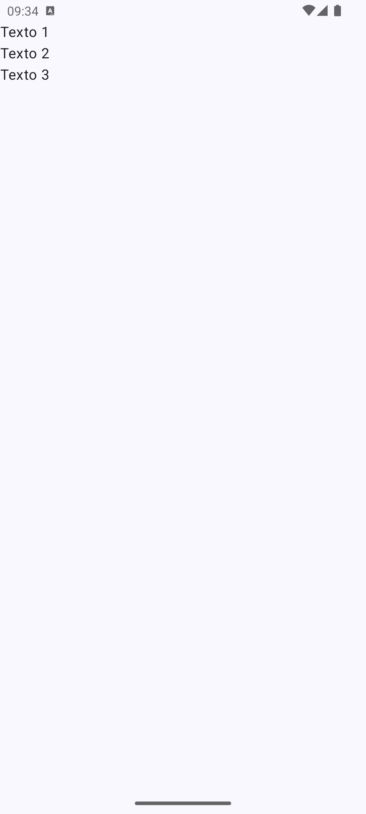
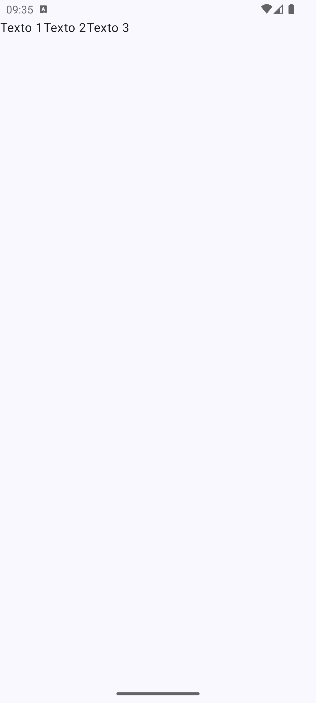

# Jetpack Compose
> ⚠️ Documento ainda não finalizado

***Jetpack Compose*** é um framework para desenvolvimento de interfaces gráficas ricas utilizando a componentização do Material Design (recurso parecido com o Bootstrap). Todo componente Jetpack é constituído de uma função implementada em Kotlin, em que o último parâmetro destas funções corresponde a uma função que irá definir o conteúdo daquele componente visual. Usa-se, portanto, o conceito de `trailing lambda` em kotlin.

> Em Kotlin, "trailing lambda" é uma sintaxe que permite mover a expressão lambda (função) para fora dos parênteses de uma função, caso ela seja o último argumento da função.

Relembrando, um exemplo de uso de *trailing lambdas*:

```kotlin
// operateOnNumbers é uma função que executa uma função recebida por parâmetro
fun operateOnNumbers(a: Int, b: Int, operation: (Int, Int) -> Int): Int {
    return operation(a, b)
}

fun main() {
    val result1 = operateOnNumbers(a=5, b=3, operation={x, y -> x * y})
    val result2 = operateOnNumbers(5, 3) { x, y -> x + y } // Trailing lambda
    println(result1) // Saída: 15
    println(result2) // Saída: 8
}
```

## Preview de Tela

O recurso de ***Preview* de Tela** permite que você visualize um conteúdo Jetpack Compose sem a necessidade de instalar o aplicativo compilado no emulador. Para usar o preview você precisa componentizar a sua interface primeiro, em funções separadas, e chamar dentro do espaço da função de preview.

```kotlin
@Composable
fun MainScreen(innerPadding: PaddingValues) {
    // code...
}

@Preview(showBackground = true)
@Composable
fun PreviewMainScreen() {
    MainScreen(innerPadding = PaddingValues(0.dp)) // visualização do componente MainScreen
}
```

## Scaffold

## Componentes de Layout

***Layouts*** são componentes que não possuem, obrigatoriamente, nenhuma característica visual, a não ser da organização de seus "filhos". Os *layouts* são utilizados como elementos que "seguram" outros elementos e os organizam na tela. Neste primeiro momento vamos conhecer dois *layouts* básicos e intuitivos, de coluna (*Column*) e linha (*Row*).

### Column

```kotlin
@Composable
fun MainScreen(innerPadding: PaddingValues) {
    Column(modifier = Modifier.padding(innerPadding)) {
        Text("Texto 1")
        Text("Texto 2")
        Text("Texto 3")
    }
}
```

<p align="center">
    
</p>

### Row

```kotlin
@Composable
fun MainScreen(innerPadding: PaddingValues) {
    Row(modifier = Modifier.padding(innerPadding)) {
        Text("Texto 1")
        Text("Texto 2")
        Text("Texto 3")
    }
}
```

<p align="center">
    
</p>


## Input

## Output